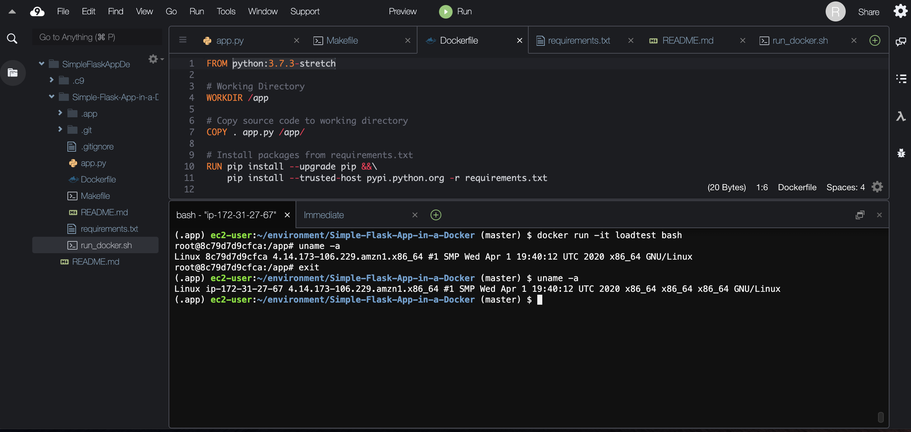
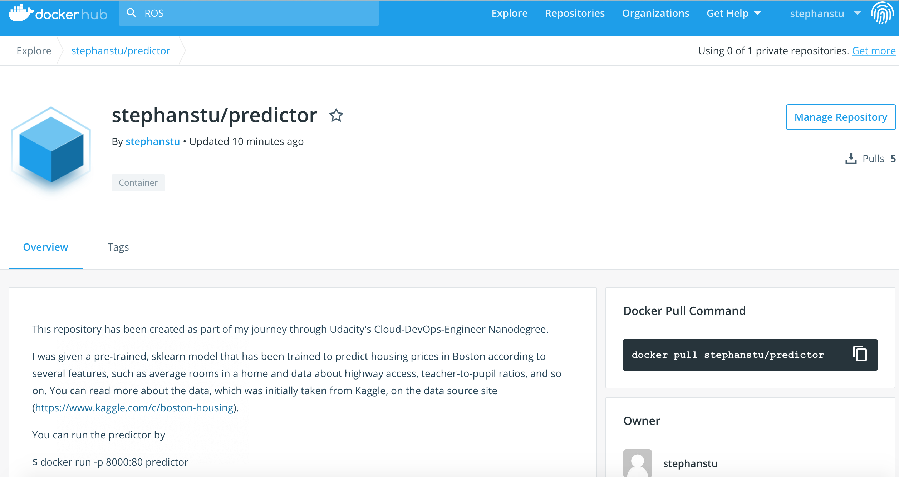
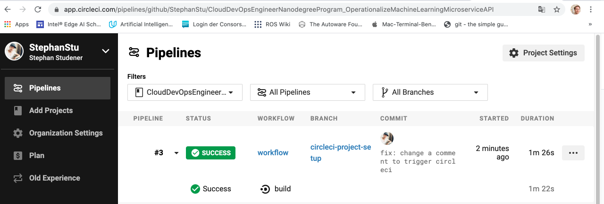

# Udacity's Cloud DevOps Engineer Nanodegree Program: Operationalization of a Machine Learning Microservice API

This repository is part of my journey through Udacity's Cloud DevOps Engineer Nanodegree Program. The project was rated as passed in May 2020.

## Project Overview

In this project, the skills acquired in Udacity's Cloud DevOps Engineer Nanodegree Program are applied to operationalize a Machine Learning Microservice API using Docker and Kubernetes.

A `sklearn` model that has been trained to predict housing prices in Boston according to several features, such as average rooms in a home and data about highway access, teacher-to-pupil ratios, is provided by Udacity. More information about the data, which was initially taken from Kaggle, can be obtained from [the data source site](https://www.kaggle.com/c/boston-housing). This project displays the ability to operationalize a Python flask app - in a provided file, `app.py` — that serves out predictions (inference) about housing prices through API calls. This project could be extended to any pre-trained machine learning model, such as those for image recognition and data labeling.

### Project Tasks

The project goal is to operationalize a working, machine learning microservice using [kubernetes](https://kubernetes.io/), which is an open-source system for automating the management of containerized applications. This includes:

* Test project code using linting
* Complete a Dockerfile to containerize this application
* Deploy the containerized application using Docker and make a prediction
* Improve the log statements in the source code for this application
* Configure Kubernetes and create a Kubernetes cluster
* Deploy a container using Kubernetes and make a prediction
* Upload a complete Github repo with CircleCI to indicate that your code has been tested

A detailed [project rubric can be found here](https://review.udacity.com/#!/rubrics/2576/view).

## Setting up the Environment
This section explains how to

* Create a virtualenv and activate it
* Run `make install` to install the necessary dependencies

It is recommended to run this inside Amazon Web Service' Cloud 9. If brew is missing on the machine,

`$ /bin/bash -c "$(curl -fsSL https://raw.githubusercontent.com/Homebrew/install/master/install.sh)"`

will install the package management tool. Then, hadolint, minikube and virtualbox can be installed on the host (MacOS, Linux). The next thing to do is to check out this repository, i.e.

`$ git clone https://github.com/StephanStu/CloudDevOpsEngineerNanodegreeProgram_OperationalizeMachineLearningMicroserviceAPI.git`

Next _cd_ into the created folder and set up a virtual python environment, i.e.

`$ python3 -m venv .env`

where _.env_ is the name of the folder where the environment resides. The virtual python environment must
be activated with

`$ source .env/bin/activate`

Note, that the virtual python environment can be deactivated with the command _deactivate_.
Now

`$ make install`

will install all necessary packages.

## Running `app.py`
There are different ways to run the machine learning microservice. Here, we treat the following ones:

1. Standalone:  `python app.py`
2. Run in Docker:  `./run_docker.sh`
3. Run in Kubernetes:  `./run_kubernetes.sh`

### Run the Application _Standalone_
After setting up a virtual environment,

`$ python app.py`

will run the app. If you are in an Amazon Web Service' Cloud 9 environment, you will be able to see the application at work on port 80.

## Run the Application _in a Docker_
The Docker image is a "small, singe-purpose virtual machine", that must be build and can be run on a host.
The file Dockerfile tells Docker how to build that machine. To execute the process,

`$ ./run_docker.sh.`

You can see the created image in the list of images by

`$ docker image ls`

To run the image locally & "enter the virtual machine"

`$ docker run -it predictor bash`

Now you are in the container. You can exit the container by _CTRL+D_.

In AWS Cloud 9, when bein "inside the virtual machine" a different version of Linux can be discovered. This can be seen in the figure below.

## Run the Application _in Kubernetes_
Kubernetes can be regarded as a "nano-cloud" for containerized applications. It helps to run and manage applications at scale.
Kubernetes draws containers from DockerHub, so the steps to run the application inside a cluster are

* Upload the Docker Image
* Configure Kubernetes to Run Locally
* Deploy with Kubernetes
* Delete Cluster
When the dockerfile builds successfully, the application is ready to be commited to the DockerHub.

### Upload the Docker Image
To upload the image to docker,

`$ ./upload_docker.sh`

Then, in your DockerHub-Account, a new repository will be created.

### Configure Kubernetes to Run on the local Host
With VirtualBox and minikube installed it is possible to start a local cluster,

`$ minikube start`

After minikube starts, a cluster will be running _locally_. One can check that one cluster is running by typing

`$ kubectl config view`

 This should display at least one cluster with a certificate-`authority` and `server`.

### Deploy with Kubernetes
Now that a docker image has been uploaded and Kubernetes has been configured such that a cluster is running, one is ready to deploy applications on the _local_ Kubernetes cluster. This involves running containerized application using kubectl, which is a command line interface for interacting with Kubernetes clusters. To launch the containerized application in the Kubernetes Cluster,

`$ run_kubernetes.sh`

Note, that it takes a while until the containerized application is ready. After the status chnages to `RUNNING` the application is waiting for calls at port 8000. The status can be checked by

`$ kubectl get pod`

### Delete Cluster
Now, stop the cluster,

`$ minikube stop`

and delete it from your host,

`$ minikube delete`

## Continuous Integration with _CircleCI_
Finally, the microservice is tested in a continuous fashion (after each commit to the code base) by configuring the repository inside CircleCI. CircleCI updates the badge that is visible at the top of this repository.

